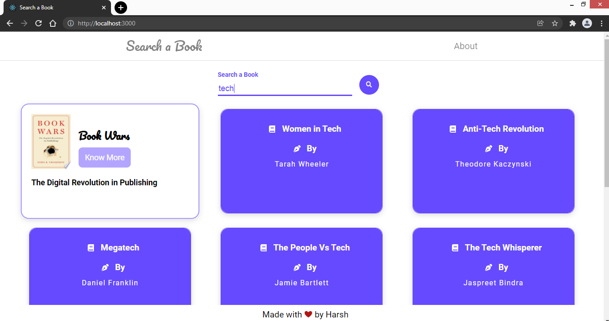

## Search a Book : Search for any book you want

The Search a Book project uses the Google Books API to search and display the books based on the text entered by the user.
See it live: https://trusting-swirles-5bb26f.netlify.app/

## Project Screenshots

## Installation and Setup Instructions

Clone down this repository. You will need `node` and `npm` installed globally on your machine.  

Installation:

`npm install`  

To Run Test Suite:  

`npm test`  

To Start Server:

`npm start`  

To Visit App:

`localhost:3000/`

#### Happy Coding! 😊
